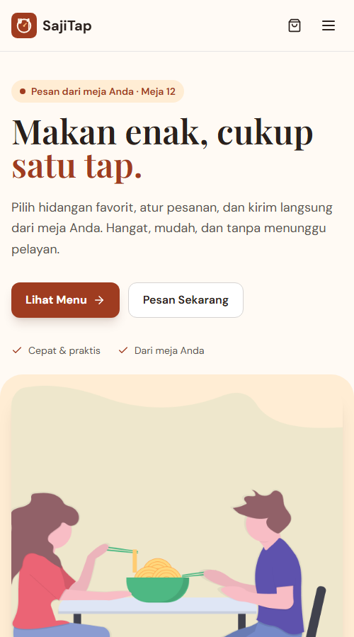
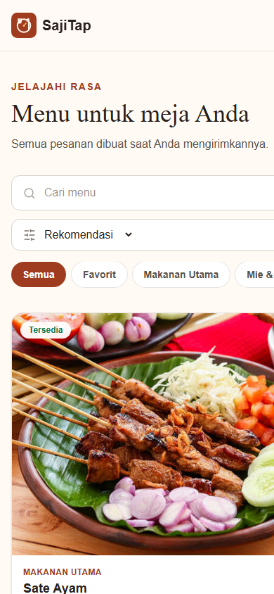
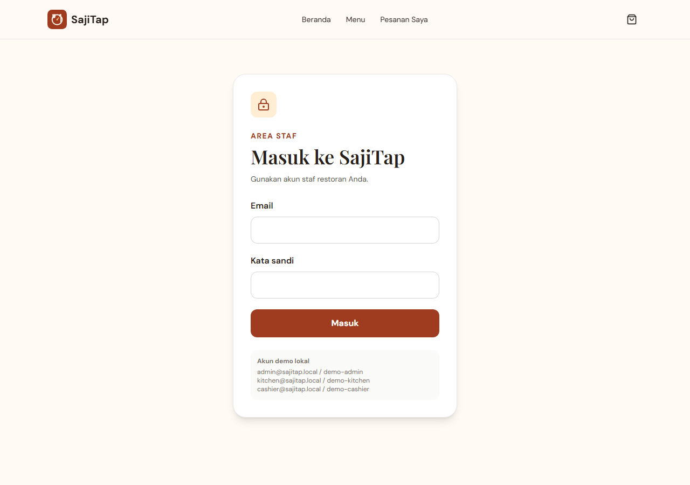

<div align="center">
  

# SajiTap

**Tap. Order. Enjoy.**

A mobile-first restaurant table-ordering system with realtime kitchen operations.


</div>

## Overview

SajiTap turns a table QR scan into a complete restaurant workflow. Guests browse an Indonesian menu, customize items, submit a server-validated order, and follow its status in realtime. Kitchen, cashier, and administrator views operate on the same tenant-scoped order data.

The application can run with a local browser-backed development adapter or a real Supabase backend. It has not been presented as deployed.

## Features

- Stable QR table routes with inactive-table validation and printable/downloadable QR codes
- Searchable five-category menu, favorites, recently viewed items, deterministic pairings, and preparation estimates
- Typed required/multi-select options, add-on pricing, notes, editable customizations, and persistent cart state
- Transactional order RPC with trusted prices, availability checks, option validation, snapshots, friendly codes, and session rate limiting
- Device-scoped order history and realtime customer progress tracking
- Supabase Auth for anonymous diners and role-based staff (`admin`, `kitchen`, `cashier`, `waiter`)
- Tenant-scoped RLS plus database-enforced order, kitchen, and payment transitions
- Realtime kitchen display, cashier workflow, nested administration, QR/table management, and actual order analytics
- Installable PWA shell with offline feedback and private API responses excluded from caching
- Accessible focus behavior, semantic controls, error recovery, responsive layouts, and route-level code splitting

## Screenshots

| Customer home                                       | Menu                                       |
| --------------------------------------------------- | ------------------------------------------ |
|  |  |



## Customer Flow

```text
QR /t/12 → menu → item options → cart → checkout
           → trusted database order → realtime tracking → device history
```

Customers are assigned an anonymous Supabase Auth session in the background; there is no customer account screen.

## Staff Flow

```text
Staff login
  ├─ Kitchen: pending → confirmed → preparing → ready
  ├─ Cashier: payment state + served/completed
  └─ Admin: orders, menu, options, categories, tables, staff, analytics
```

## Architecture

UI components call a service layer rather than Supabase directly. Zustand owns device state, React context owns asynchronous catalog/auth state, Postgres owns durable restaurant data, and RPCs own privileged state transitions.

See [`docs/architecture.md`](docs/architecture.md), [`docs/database.md`](docs/database.md), and [`docs/security.md`](docs/security.md) for the runtime boundaries, schema setup, and authorization model.

## Tech Stack

| Technology              | Purpose                                          |
| ----------------------- | ------------------------------------------------ |
| React 19 + React Router | Customer and staff application                   |
| TypeScript              | Strict domain modeling                           |
| Vite + Vite PWA         | Build, lazy chunks, manifest, and offline shell  |
| Tailwind CSS            | Mobile-first visual system                       |
| Zustand                 | Cart, table, preferences, and device order state |
| Supabase                | Postgres, Auth, Realtime, RLS, and RPCs          |
| Vitest                  | High-value domain and service tests              |
| QRCode + Lucide React   | Table QR generation and interface icons          |

## Database

Versioned SQL in `supabase/migrations/` creates restaurant, table, catalog, order, snapshot, and staff-profile data. `supabase/seed.sql` provides the demo restaurant and menu. Critical totals are calculated in Postgres; the browser never supplies an authoritative price.

Staff Auth users are environment-specific and are therefore not created by the seed.

## Local Development

```bash
git clone https://github.com/Freddy47588/sajitap-restaurant-ordering.git
cd sajitap-restaurant-ordering
npm install
copy .env.example .env.local
npm run dev
```

Open `http://localhost:5173/t/12` to simulate a table scan. The checked-in `.env.example` selects local mode, which includes documented demo staff accounts on the login screen.

To use Supabase, install its CLI, start Docker, run `supabase start` and `supabase db reset`, then use the local project URL and anon key. Full instructions are in [`docs/database.md`](docs/database.md).

## Environment Variables

| Variable                 | Description                                  |
| ------------------------ | -------------------------------------------- |
| `VITE_DATA_MODE`         | `local` or `supabase`                        |
| `VITE_RESTAURANT_SLUG`   | Public restaurant tenant slug                |
| `VITE_SUPABASE_URL`      | Supabase project URL                         |
| `VITE_SUPABASE_ANON_KEY` | Public browser key; never a service-role key |

## Testing

```bash
npm run lint
npm test
npm run build
npm run format:check
npm audit
```

The focused suite covers currency formatting, table parsing/catalog integrity, option selection rules, cart identity and totals, server-authoritative behavior in the local order adapter, status transitions, authentication, menu loading, and device order storage.

## Routes

| Area           | Routes                                                                                                             |
| -------------- | ------------------------------------------------------------------------------------------------------------------ |
| Customer       | `/`, `/t/:tableNumber`, `/menu`, `/menu/:id`, `/cart`, `/checkout`, `/order/:orderCode`, `/orders`                 |
| Operations     | `/kitchen`, `/cashier`                                                                                             |
| Administration | `/admin`, `/admin/orders`, `/admin/menu`, `/admin/categories`, `/admin/tables`, `/admin/staff`, `/admin/analytics` |
| Authentication | `/staff/login`                                                                                                     |

## Roadmap

- Provision staff invitations and password recovery through a trusted server-side administration path
- Add deployment-specific monitoring, edge rate limits, and backup/restore drills
- Add maintained browser end-to-end tests when a CI browser environment is selected
- Evaluate SSR or prerendering only if public menu discovery becomes a product requirement

## Legacy Modernization

SajiTap began as a Vue 2 culinary-ordering exercise. The current application replaces Vue CLI, Vue Router, BootstrapVue, Axios, toast plugins, and the external JSON demo dependency with a strict React architecture, modern state management, a relational backend, realtime operations, and defense-in-depth authorization. The Indonesian food identity and useful original photography were retained.

## License

This project is provided for portfolio and learning purposes.
